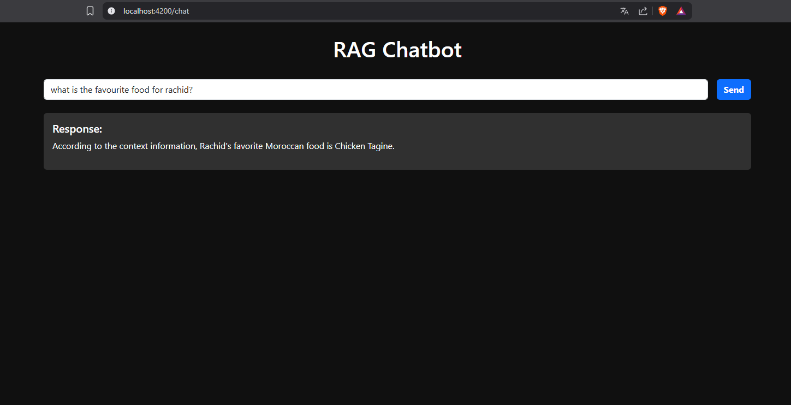

# 🧠 RAG Chatbot for PDF Documents



A full-stack RAG (Retrieval-Augmented Generation) chatbot that allows users to ask questions about the content of a PDF document. The system uses **Spring Boot + Spring AI + Ollama + Vector Store** on the backend and **Angular** on the frontend.

---

## 🚀 Features

- Chat interface with real-time Q&A
- Ingests PDF and converts it into searchable vector embeddings
- Uses Retrieval-Augmented Generation (RAG) for context-aware responses
- Angular frontend with Markdown rendering and loading indicators
- Powered by **Spring AI** and **Ollama LLM**

---

## 🏗️ Architecture

```plaintext
Angular (Frontend)
     ⇅ HTTP (REST API)
Spring Boot (Backend)
     ⇅
Spring AI → Ollama + Vector Store (Embeddings)
     ⇅
PDF File (source document)

```

## 📂 Project Structure

```plaintext
rag-pdf-chatbot/
├── rag_ai_chatbot_backend/ # Spring Boot + Spring AI backend
├── rag_ai_chatbot_frontend/ # Angular frontend
└── README.md # Project documentation

```

---

## 📦 Backend Technologies

- Java 21
- Spring Boot 3.4+
- Spring AI
- Ollama LLM
- Vector Store (for semantic embeddings)
- Apache Tika (for reading PDFs)

---

## 🖥️ Frontend Technologies

- Angular 19
- Angular Material (`mat-spinner`)
- Bootstrap 5
- `ngx-markdown` for rendering AI responses

---

## 🛠️ Setup Instructions

### 1. Clone the Repository

```bash
git clone https://github.com/your-username/rag-pdf-chatbot.git
cd rag-pdf-chatbot
```

---

## 2. Backend Setup (Spring Boot)

```bash
cd rag_ai_chatbot_backend
mvn clean install
```

Make sure Ollama is running and a model like llama3 is installed:

```bash
ollama run llama3
```

Then start the backend:

```bash
mvn spring-boot:run
```

✅ This will automatically:

- Read sample1.pdf

- Embed its content

- Store it in memory using the vector store

---

## 3. Frontend Setup (Angular)

```bash
cd rag_ai_chatbot_frontend
npm install
ng serve
```

Visit your app in the browser: http://localhost:4200

## 💬 Usage

1. **Type a question in the input box related to the PDF content.**

2. **Click Send.**

3. **The backend retrieves relevant content chunks from the vector store.**

4. **The LLM (via Ollama) generates a response.**

5. **The frontend displays the result using Markdown.**

## 📁 Default PDF

- Default file location:

```bash
src/main/resources/pdf/sample1.pdf
```

You can replace this file with your own document to train the chatbot on different content.
